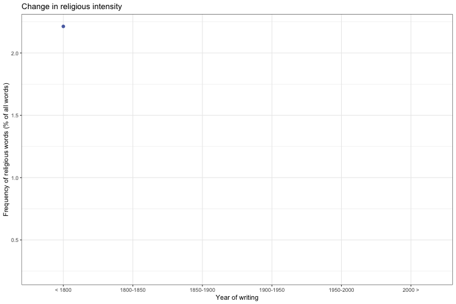

# Introduction to Cultural Data Science - Analysing Højskolesangbogen

 
# Overview 

**Jakob Grøhn Damgaard, Januray 2021**  
This repository contains the full exam project for the course Introduction Cultural Data Science at the Faculty of Arts at Aarhus University.  

## Project Abstract
Comprising more than 600 songs and hymns, the Danish Højskolesangbog could provide a fruitful insight into the historic evolution of Danish song culture. However, in order to perform robust quantitative research on this data using modern language processing techniques a digital, tidy data set must be available.  As this is currently not the case, this study aims to assemble a digital corpus of the songs by web scraping højskolesangbogen.dk. This data set is then utilized to analyse and visualise the historic development in the use of religious language in the songs. The study concludes that there has been a general decline in the frequency of words tied to Christianity, however, with a few notable offshoots.

## Animation of development in use of religious language
 

# Software
All data operations were performed on a 2020 MacBook Pro 13’’, 2 GHz Quad-Core Intel Core i5, 16 GB Ram running macOS Catalina (10.15.6).  
Following software was used: 
  
<ul>
<li>Python (3.8.5)</li>
<li>R (4.0.02)</li>
<li>RStudio (1.3.1093)</li>
<li>Visual Studio Code (1.52.1)</li>
<li>Jupyter Extension (1.0.0) for  Visual Studio Code </li>
</ul>
 
Chrome extension software:
 
 <ul>
<li>1. SelectorGadget (1.1.1) </li>
<li> 2. Link Clipper (2.4.1) </li>
</ul>
 
 

# Files 
 This repository is structured as follows:
  
<ul>
<li><strong>Data folder:</strong></li>
<ul>
<li><em>clean_song_data_with_word_counts.csv</em> - CSV file containing the full, cleaned data frame outputted from the Python script</li>
<li><em>song_urls.csv</em> - CSV file containing list of URLs linking to web pages for each individual song</li>
<li><em>song_vocabulary.csv</em> - CSV file containing a list of all unique tokens in the song lyrics</li>
<li><em>song_vocabulary.pkl</em> - Pickle file containing a list of all unique tokens in the song lyrics</li>
</ul>
<li><strong>Visualisations</strong> folder:</li>
<ul>
</li>
<li><em>aggregated_15.png</em> - Plot showing development in religious language use when songs have been grouped and aggregated across 15 songs</li>
<li><em>aggregated_songs_15_religious_intensity.gif</em> - GIF showing unsmoothed development in religious 
language use when songs have been grouped and aggregated across 15 songs</li>
<li><em>interval_plot.gif</em> - GIF showing  development in religious language use when songs have been grouped and aggregated across 6 time intervals</li>
</ul>
</li>
<li><em>analysing_hojskolesangbogen.ipynb</em> - Jupyter notebook script containing code for autmated web scraping and preprocssing of the scraped data into a tidy data set</li>
<li><em>analysing_hojskolesangbogen.rmd</em> - RMarkdown script containing analysis and visualisations of development in religious language use </li>
<li><em>requirements.txt</em> - TXT file containing requirements for running  *analysing_hojskolesangbogen.ipynb* script locally</li>
</ul>

## Metadata
 
Following metadata list provides an explanation of the columns in the full cleaned data set, <em>clean_song_data_with_word_counts.csv</em>, produced by the <em>analysing_hojskolesangbogen.ipynb</em>:

<ul>
<li><em>songwriter</em> - This column contains the name of the primary songwriter - Type: string</li>
<li><em>year_written</em> - This column contains the year the song was written - Type: numeric </li>
<li><em>cinoiser</em> - This column contains the name of the primary composer - Type: string</li>
<li><em>year_composed</em> - This column contains the year the song was composed - Type: numeric </li>
<li><em>lyrics</em> - This column contains the song lyrics- Type: string</li>
<li><em>title</em> - This colummn contains the song title - Type: string </li>
<li><em>columns numbered 9-13326</em> - These columns contain words counts and each represent a unique word in the vocabulary - Type: numeric </li>
</ul>

# Execution and requirements
The RMarkdown <em>analysing_hojskolesangbogen.rmd</em> file can be directly executed in the desktop version RStudio (1.3.1093) as long as base R (4.0.02) has been installed. All packages are installed, loaded and managed using the package manager 'pacman'. 
  
The <em>analysing_hojskolesangbogen.ipynb</em> file Package requirements are found in the <em>requirements.txt</em> file. Alternatively, the code can be executed more easily using Google Colab which means no packages have to be installed locally. This only demands that one has an active Google account. You can access the script using the following link: 
https://colab.research.google.com/drive/1DggRL25M4LWOkSxmtHa7Mlqv9c010Hv0#scrollTo=dhG1vgE54K1-
 

# Package and software references

Bird, S., Klein, E., & Loper, E. (2009). Natural language processing with Python: analyzing text with the natural language toolkit. " O'Reilly Media, Inc.".
  
Chandra, R. V., & Varanasi, B. S. (2015). Python requests essentials. Packt Publishing Ltd.
  
Van Rossum, G., & Drake Jr., F. L. (1995). Python Reference Manual. Centrum voor Wiskunde en Informatica Amsterdam.
  
R Core Team (2020). R: A language and environment for statistical computing. R Foundation for Statistical Computing, Vienna, Austria. URL https://www.R-project.org/.
  
Richardson, L. (2019). Beautiful Soup Documentation. 84.
  
Ooms, J. (2018). gifski: Highest Quality GIF Encoder. R package version 0.8.6.
https://CRAN.R-project.org/package=gifski
  
Pedersen, T. L. & Robinson, D. (2020). gganimate: A Grammar of Animated
Graphics. R package version 1.0.7. https://CRAN.R-project.org/package=gganimate
  
Pedregosa, F., Varoquaux, G., Gramfort, A., Michel, V., Thirion, B., Grisel, O., ... & Vanderplas, J. (2011). Scikit-learn: Machine learning in Python. the Journal of machine Learning research, 12, 2825-2830.
  
Rinker, T. W. & Kurkiewicz, D. (2017). pacman: Package Management for R. version 0.5.0.
Buffalo, New York. http://github.com/trinker/pacman
  
Varoquaux, G., & Grisel, O. (2009). Joblib: running python function as pipeline jobs. packages. python. org/joblib.
  
Walt, S. V. D., Colbert, S. C., & Varoquaux, G. (2011). The NumPy array: a structure for efficient numerical computation. Computing in science & engineering, 13(2), 22-30.
  
Wickham, H., Francois, R., Henry, L., & Müller, K. (2015). dplyr: A grammar of data manipulation. R package version 0.4, 3.
  
Wickham et al., (2019). Welcome to the tidyverse. Journal of Open Source Software,
  4(43), 1686, https://doi.org/10.21105/joss.01686
   
  
# License
Shield: [![CC BY-SA 4.0][cc-by-sa-shield]][cc-by-sa]

This work is licensed under a
[Creative Commons Attribution-ShareAlike 4.0 International License][cc-by-sa].

[![CC BY-SA 4.0][cc-by-sa-image]][cc-by-sa]

[cc-by-sa]: http://creativecommons.org/licenses/by-sa/4.0/
[cc-by-sa-image]: https://licensebuttons.net/l/by-sa/4.0/88x31.png
[cc-by-sa-shield]: https://img.shields.io/badge/License-CC%20BY--SA%204.0-lightgrey.svg

